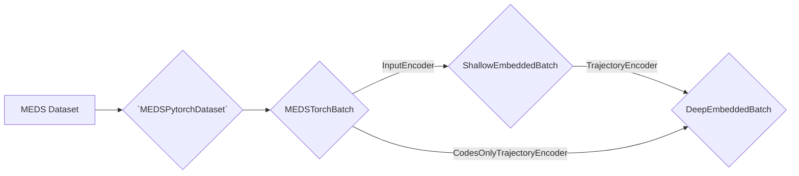

# MEDS TorchEncoders

Helpers to build PyTorch AI models over MEDS datasets.

# Installation

```bash
pip install meds-torch-encoders
```

# Model Components

We subdivide the modeling into the following steps:


